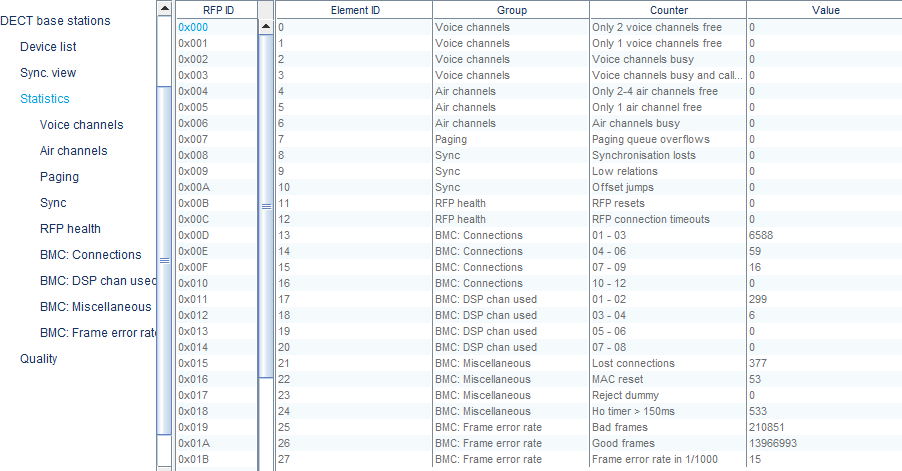
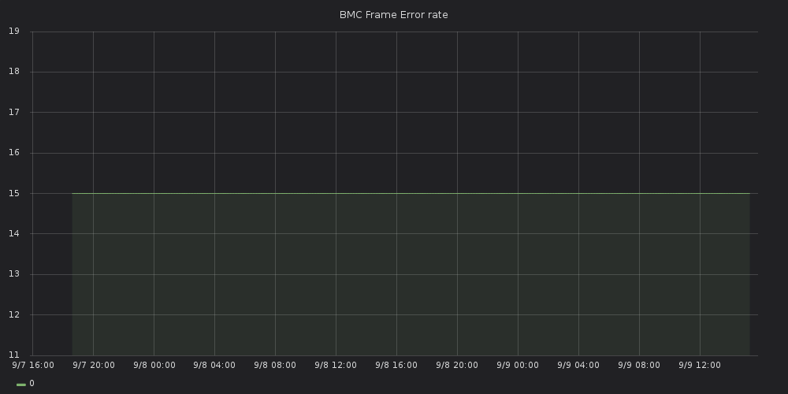

## What?
Fetch all RFP, User and PP statistics from OMM (Open Mobility Manager) and send them to a graphite endpoint.

## Why?
The OMP table view is not really helpful. And we like fancy grafana dashboards. 


## Can I take a look?


More screenshots will be added after the next event.

## How

#### checkout & run
``` sh
$ git clone --recurse-submodules https://github.com/eventphone/ommstats.git
$ cd ommstats/src/ommstats
$ dotnet run
```

#### configuration
All options can be configured in [appsettings.json](src/ommstats/appsettings.json)

Most options should be self explanatory.
- Interval: number of seconds between fetching & submitting stats
- Default Loglevel: may be set to `Debug` to enable raw message logging for OMM and graphite
- DisableColors: helpful when redirecting the output to a file.